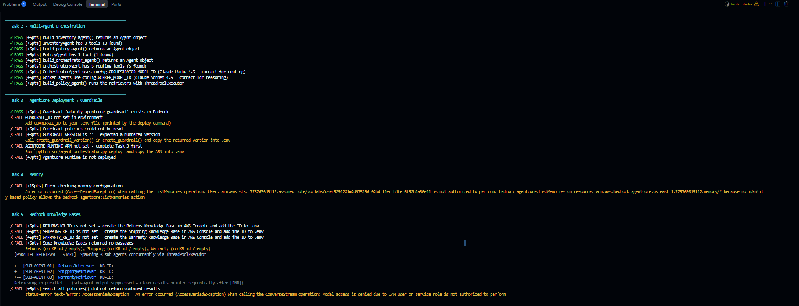
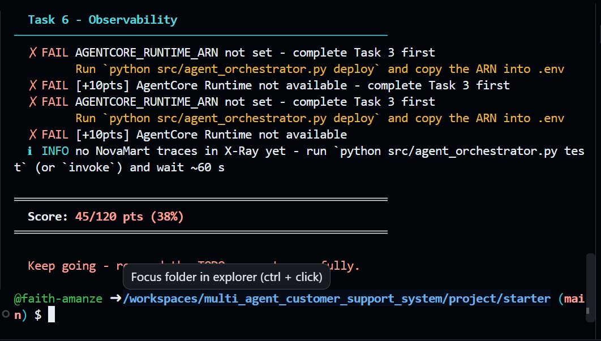

# Enterprise Multi-Agent Architecture with Amazon Bedrock AgentCore

**Udacity - School of AI | Course 3.3 | Capstone Project 3.3 NovaMart**

A production-grade multi-agent customer support system built with the [Strands Agents SDK](https://github.com/strands-agents/sdk-python) and Amazon Bedrock AgentCore. The system automatically routes customer support requests to specialist agents, retrieves grounded knowledge via **parallel multi-agent RAG**, enforces enterprise safety guardrails, and maintains shared workflow state across agents - all observable through CloudWatch and X-Ray.


---

## Architecture

```
Customer Request
      │
OrchestratorAgent (Claude Haiku 4.5 - routes requests, manages WorkflowState)
      │
   ┌──┼──────────────────────────┬──────────────────┐
   │  │                          │                  │
InventoryAgent    PolicyAgent    RefundAgent    CommunicationAgent
(DynamoDB)     (Multi-Agent RAG)  (DynamoDB)     (synthesizes response)
                     │
         ┌───────────┼───────────┐
    ReturnsPolicyRetriever  ShippingPolicyRetriever  WarrantyPolicyRetriever
    (Bedrock KB)          (Bedrock KB)              (Bedrock KB)
         └───────── run in PARALLEL ───────────┘

Shared State: DynamoDB WorkflowStateTable (with optimistic locking)
```
### Agent Roles

| Agent | Model | Responsibility | Tools |
|-------|-------|-----------------|-------|
| **OrchestratorAgent** | Claude Haiku 4.5 | Routes requests, creates/updates WorkflowState | `initialize_session`, `route_to_inventory_agent`, `route_to_policy_agent`, `route_to_refund_agent`, `route_to_communication_agent` |
| **InventoryAgent** | Claude Sonnet 4.5 | Gathers order and customer facts from DynamoDB | `check_order_status`, `get_customer_tier`, `list_customer_orders` |
| **PolicyAgent** | Claude Sonnet 4.5 | Coordinates parallel RAG retrieval from 3 KBs, synthesizes results | `search_all_policies` (internally fans out to 3 retriever sub-agents) |
| **RefundAgent** | Claude Sonnet 4.5 | Makes return/refund eligibility decisions (30-day Standard, 60-day Premium) | `get_inventory_context`, `initiate_refund` |
| **CommunicationAgent** | Claude Sonnet 4.5 | Drafts final, empathetic customer-facing response | `get_full_workflow_context` |


### Key Features

- **Multi-Agent RAG**: PolicyAgent runs 3 specialized retriever sub-agents in parallel using ThreadPoolExecutor, merges results, and deduplicates by relevance
- **Shared Workflow State**: DynamoDB `WorkflowStateTable` with optimistic locking (version-based conditional writes) ensures consistency across concurrent agent updates
- **Enterprise Guardrails**: Bedrock Guardrails block harmful content, PII, and off-topic conversations
- **Observability**: Every request is traced to AWS X-Ray (Orchestrator → Worker → Knowledge Base call chain) and logged to CloudWatch Logs - locally and from the deployed runtime
- **Bedrock Knowledge Bases**: Uses an S3 Vectors backing store (vector bucket + one index per KB, created by the stack) for policy retrieval (no custom embeddings)

---


## Prerequisites

- Python 3.11+
- AWS account with Bedrock access enabled (`us-east-1` region)
- IAM permissions for: Bedrock, Bedrock AgentCore, DynamoDB, S3, S3 Vectors, CloudFormation, CloudWatch, X-Ray
- Bedrock Knowledge Bases created manually in AWS Console (Task 5)
- The AgentCore Runtime runs on arm64 and Python 3.12; the deploy command downloads matching wheels for you (needs `pip` and internet access)

---

## Setup

### 1. Install Dependencies

```bash
pip install -r requirements.txt
```

### 2. Configure Environment

```bash
# Copy .env template
cp .env.example .env

# Verify AWS resources
python config.py
```

Expected output: Configuration table showing all resource names. Fields showing `(not yet created)` are expected - they are populated as each task is completed.

### 3. Seed Initial Data

Run once after the CloudFormation stack reaches `CREATE_COMPLETE`:

```bash
python infrastructure/seed_data.py
```

This populates:
- DynamoDB tables with four mock customers (`CUST-001` … `CUST-004`) and their orders. The data is deterministic - the order IDs used by `demo.py`, `test` mode and the `chat` welcome table (e.g. `ORD-27176`) always exist
- S3 `policy-docs` bucket with sample policy documents under `policies/returns/`, `policies/shipping/`, `policies/warranty/`

---

## Project Structure

```
starter/
│
├── config.py                              # Central configuration (reads CloudFormation exports + env vars)
├── requirements.txt                       # Python dependencies
├── .env.example                           # Environment variable template
├── README.md                              # This file
│
├── src/                                   # Implementation files
│   ├── agent_orchestrator.py             # Multi-agent orchestration (Tasks 2, 3, 4, 6) ⭐
│   ├── agent_utils.py                    # Pre-written: terminal trace UI utilities
│   ├── agent_observability.py            # Pre-written: X-Ray tracing + CloudWatch logging layer
│   ├── bedrock_kb_retrieval.py           # Pre-written: KB retrieval helper
│   └── demo.py                           # Pre-written: demo script
│
├── infrastructure/
│   ├── starter_stack.yaml                 # CloudFormation: foundation infra (DynamoDB, S3, S3 Vectors, IAM, CloudWatch)
│   ├── seed_data.py                       # Data seeding script
│   └── cleanup.py                         # Deletes everything the project created (run when done)
│
└── tests/
    └── test_agent.py                      # Automated test suite
```

### Files to Never Modify
- `config.py` - Central configuration
- `tests/test_agent.py` - Automated tests
- `infrastructure/` - Pre-deployed resources
- `src/agent_utils.py` - Terminal trace UI utilities
- `src/agent_observability.py` - X-Ray tracing and CloudWatch logging
- `src/bedrock_kb_retrieval.py` - KB retrieval helper
- `src/demo.py` - Demo script

---

## Tasks & Implementation

### Task 2 - Multi-Agent Graph
**File:** `src/agent_orchestrator.py`
**Time:** ~90 minutes

Implement 5 Strands Agents in an Orchestrator → Workers hierarchy:

#### **2.A - InventoryAgent**
Gathers order and customer facts from DynamoDB (no decisions).
- **Tools:** `check_order_status`, `get_customer_tier`, `list_customer_orders`
- **Model:** Claude Sonnet 4.5 (`config.WORKER_MODEL_ID`) | **Temperature:** 0.1
- The Orders table has a composite key (`customer_id` + `order_id`), so `check_order_status` takes both - the stub already has the right signature

#### **2.B - RefundAgent**
Makes return/refund eligibility decisions based on customer tier and dates.
- **Tools:** `get_inventory_context`, `initiate_refund`
- **Model:** Claude Sonnet 4.5 (`config.WORKER_MODEL_ID`) | **Temperature:** 0.1

#### **2.C - PolicyAgent** ⭐
**Multi-Agent RAG Coordinator:** Runs 3 retriever sub-agents in parallel.
```
PolicyAgent
    ├─ ReturnsPolicyRetriever  → config.RETURNS_KB_ID
    ├─ ShippingPolicyRetriever → config.SHIPPING_KB_ID
    └─ WarrantyPolicyRetriever → config.WARRANTY_KB_ID
```
- **Tool:** `search_all_policies` - fans out to all 3 retrievers via ThreadPoolExecutor
- **Output:** Merged, deduplicated results ranked by relevance
- **Model:** Claude Sonnet 4.5 (`config.WORKER_MODEL_ID`) | **Temperature:** 0.2

#### **2.D - CommunicationAgent**
Composes final customer-facing response from accumulated WorkflowState.
- **Tools:** `get_full_workflow_context`
- **Model:** Claude Sonnet 4.5 (`config.WORKER_MODEL_ID`) | **Temperature:** 0.3

#### **2.E - OrchestratorAgent**
Routes requests and manages shared WorkflowState.

- **Tools:** `initialize_session`, `route_to_inventory_agent`, `route_to_policy_agent`, `route_to_refund_agent`, `route_to_communication_agent`
- **Model:** Claude Haiku 4.5 (`config.ORCHESTRATOR_MODEL_ID` - fast, cost-efficient) | **Temperature:** 0.0 (deterministic)

The orchestrator system prompt must enforce these routing rules exactly:

| Rule | Trigger | Action |
|------|---------|--------|
| 1 | Every request, always | Call `initialize_session` first |
| 2 | Order status / return / refund requests | Call `route_to_inventory_agent` → then `route_to_refund_agent` |
| 3 | Policy meaning questions (windows, rates, terms) | Call `route_to_policy_agent` |
| 4 | Account questions ("what is my tier?", "am I premium?") | Call `route_to_inventory_agent` - **never** `route_to_policy_agent` (it only knows policy text, not customer data) |
| 5 | Math / calculation questions | Answer directly - no routing needed |
| 6 | Every request, always (last step) | Call `route_to_communication_agent` to compose the final reply |

> **CRITICAL:** The Orchestrator is **never** permitted to write the final customer-facing response itself. It must always delegate to `route_to_communication_agent` as its very last action - no exceptions, even when it believes it already has a complete answer.

**Test:**
```bash
python tests/test_agent.py task2
```

---

### Task 3 - AgentCore Runtime & Guardrails
**File:** `src/agent_orchestrator.py`

- **`create_guardrail()`** - Create Bedrock Guardrail with:
  - Content filtering: SEXUAL, VIOLENCE, HATE (HIGH strength) + INSULTS, MISCONDUCT (MEDIUM strength)
  - PII redaction (emails, phones anonymized; credit cards and SSNs blocked)
  - Topic blocking (competitor products, pricing negotiations, legal threats)
  - Profanity filtering
  - Then `create_guardrail_version()` so the returned version is a number, not `DRAFT`

- **`deploy_to_agentcore_runtime()`** - Deploy the system to AgentCore Runtime with the guardrail attached
  - The pre-written part zips your `agent_orchestrator.py` (which doubles as the HTTP entry point - `serve` mode) with its helper modules and arm64 dependencies, and uploads it to S3 (*direct code deployment*)
  - Your part: `create_agent_runtime()` with `codeConfiguration` pointing at that zip, `networkMode: PUBLIC`, `serverProtocol: HTTP`, and environment variables (region, project name, KB IDs, log group, `GUARDRAIL_ID`, `GUARDRAIL_VERSION`)
  - **How the guardrail is attached:** `create_agent_runtime()` has no guardrail parameter. Guardrails are enforced per model call, so the pre-written `_apply_guardrail()` sets `guardrail_id` / `guardrail_version` on every agent's `BedrockModel` whenever `GUARDRAIL_ID` and `GUARDRAIL_VERSION` are known - from `.env` locally, from the runtime environment variables you pass when deployed

**Deploy & Test:**
```bash
python src/agent_orchestrator.py deploy
```

The deploy command prints the Runtime ARN and Guardrail ID/Version on completion. Copy those values into your `.env` file:

```
AGENTCORE_RUNTIME_ARN=<printed arn>
GUARDRAIL_ID=<printed id>
GUARDRAIL_VERSION=<printed version>
```

Then run the tests:
```bash
python tests/test_agent.py task3
```

---

### Task 4 - Memory
**File:** `src/agent_orchestrator.py`

- **`configure_memory(runtime_arn)`** - Create an AgentCore Memory resource with `agentcore_control.create_memory()`:
  - Strategy: SESSION_SUMMARY (`summaryMemoryStrategy`)
  - Storage: `eventExpiryDuration=7` days
  - Maintains conversation context across turns so customers don't repeat themselves between turns
  - The pre-written part waits until the resource is `ACTIVE`; the test finds it by name (`config.MEMORY_NAME`)

**Test:**
```bash
python tests/test_agent.py task4
```

---

### Task 5 - Bedrock Knowledge Bases (Not in starter - done in AWS Console)

Create 3 Knowledge Bases in the AWS Console. The S3 data bucket and the S3 Vectors bucket are the same for all three - only the prefix and the vector index differ. Run `python config.py` to print the exact bucket and index names for your account (they carry a stack-specific suffix):

| Setting | Returns KB | Shipping KB | Warranty KB |
|---|---|---|---|
| S3 data bucket | *Policy Bucket* from `python config.py` | same | same |
| S3 prefix | `policies/returns/` | `policies/shipping/` | `policies/warranty/` |
| Embedding model | `amazon.titan-embed-text-v2:0` | same | same |
| Vector store | S3 Vectors → *Use an existing vector bucket* | same | same |
| Vector bucket | *Vector Bucket* from `python config.py` | same | same |
| Vector index | `returns-policy-index` | `shipping-policy-index` | `warranty-policy-index` |

The vector bucket and the three indexes are created by the CloudFormation stack (dimension 1024, cosine, `AMAZON_BEDROCK_TEXT` non-filterable), so pick them in the wizard - do **not** use *Quick create a new vector store*. After creating each KB, click **Sync** on its data source.

After creating all three KBs, add their IDs to `.env`:
```
RETURNS_KB_ID=
SHIPPING_KB_ID=
WARRANTY_KB_ID=
```

**Test:**
```bash
python tests/test_agent.py task5
```

---

### Task 6 - Observability
**File:** `src/agent_orchestrator.py`

- **`configure_observability(runtime_arn)`** - Enable logging and tracing by building a `loggingConfiguration` and handing it to the pre-written `apply_observability_config()` (wrapped in `try/except`):
  - **CloudWatch:** `cloudWatchConfig` - INFO-level logs to `config.AGENT_LOG_GROUP` (`/aws/bedrock/agentcore/udacity-agentcore`), `enabled=True`
  - **X-Ray:** `xRayConfig` - `enabled=True`, `samplingRate=1.0` (100% in dev, reduce to 5% in prod)
  - `apply_observability_config()` turns that into real AWS state: it enables CloudWatch **Transaction Search** (the mechanism AgentCore Observability uses) at the given sampling percentage, creates the log group, and stores the settings as environment variables on your AgentCore Runtime so the deployed agent logs and traces exactly as configured

**How traces reach X-Ray:** `agent_observability.py` (pre-written) records every request as one X-Ray trace. Each `route_to_*` tool becomes a worker-agent node and each Knowledge Base retrieval a `KnowledgeBase:*` node, published with `xray:PutTraceSegments`. This works identically from your machine (`test`, `chat`, `demo`) and inside the deployed runtime (`invoke`).

**After testing, verify end-to-end tracing:**
```bash
python tests/test_agent.py task6

# Then run a live test - each scenario prints its X-Ray trace id
python src/agent_orchestrator.py test

# View the map in AWS Console → CloudWatch → X-Ray traces → Service map
# (or X-Ray → Service map). Select "Last 5 minutes"; allow 30-60 s.
```

---

### Deployment Pipeline

When you run `python src/agent_orchestrator.py deploy`, it executes a 6-step pipeline:

| Step | What it does |
|------|-------------|
| 1/6 | Build the 5-agent graph locally |
| 2/6 | Create the Bedrock Guardrail |
| 3/6 | Package the code (arm64 zip) and deploy to AgentCore Runtime |
| 4/6 | Create AgentCore Memory |
| 5/6 | Configure Observability (CloudWatch + X-Ray Transaction Search) |
| 6/6 | Deploy AgentCore Gateway *(skipped if Lambda tool functions not deployed)* |

Step 6 is pre-written scaffolding — it registers your Lambda-backed tool APIs on a managed MCP endpoint so agents can discover and invoke them at runtime. It requires Lambda functions to be deployed separately and their names set as `ORDERS_FUNCTION`, `POLICY_FUNCTION`, `CUSTOMERS_FUNCTION` in your `.env`. If those aren't set, Step 6 prints a note and the rest of the deployment completes normally.

---

### Task 7 - End-to-End Submission Test

After completing all tasks, run the full deployment and verify these three scenarios manually:

| Scenario | Expected Routing |
|----------|-----------------|
| `"I want to return my order ORD-27176"` (CUST-001) | Orchestrator → Inventory → Refund → Communication |
| `"What is the return policy for premium customers?"` | Orchestrator → Policy (3 parallel KB retrievers) → Communication |
| `"How much are 5 items at $29.99 with 10% off?"` | Orchestrator answers directly (no sub-agent routing needed) |

**Required deliverable:** 
- Take a screenshot that shows that all test passed, and shows that you have 120 scores (`python tests/test_agent.py all`).
- Take a screenshot of your **X-Ray Service Map** after running a live request (`python src/agent_orchestrator.py test`). Navigate to **AWS Console → CloudWatch → X-Ray traces → Service map** (also reachable as X-Ray → Service map) and capture the full trace graph showing the `NovaMart-Orchestrator` → Worker (→ Knowledge Base) call chain.

---

### Task 8 - Clean Up

Once you have your screenshots and have submitted the project, remove everything the project created so it stops costing money:

```bash
python infrastructure/cleanup.py          # dry run - lists what would be deleted
python infrastructure/cleanup.py --yes    # deletes it
```

The script deletes, in dependency order: the three Knowledge Bases (with their data sources and the service roles the console created for them), the AgentCore Runtime and Memory, the Guardrail, the contents of the policy bucket, the CloudFormation stack (DynamoDB tables, buckets, S3 Vectors bucket and indexes, execution role, log group) and the runtime log groups. Deletions of Knowledge Bases and AgentCore resources are asynchronous - run it a second time to confirm nothing is left. Add `--disable-transaction-search` if you also want to switch CloudWatch Transaction Search back off.

> Do this **after** submitting: the reviewer needs your screenshots, but nothing in the reviewed submission depends on the resources still existing.

---

## Testing

### Automated Tests

Run individual task tests:
```bash
python tests/test_agent.py task2   # Multi-agent orchestration
python tests/test_agent.py task3   # AgentCore deployment
python tests/test_agent.py task4   # Memory
python tests/test_agent.py task5   # Knowledge base retrieval
python tests/test_agent.py task6   # Observability
```

Run full suite:
```bash
python tests/test_agent.py all
```

Expected output:
- Color-coded test results (✓ pass, ✗ fail)
- Summary at the end

### Live Testing

Run 3 hardcoded end-to-end scenarios against your local agent:
```bash
python src/agent_orchestrator.py test
```

Launch an interactive terminal session with step-by-step trace output:
```bash
python src/agent_orchestrator.py chat
```

Send one message to the **deployed** AgentCore Runtime (after Task 3):
```bash
python src/agent_orchestrator.py invoke "What is the return policy for premium customers?" CUST-002
```

The `chat` command opens a conversation loop where you type queries and watch the orchestrator route them in real time - colour-coded by agent (Inventory, Policy, Refund, Communication). It uses a pre-written terminal UI (`AgentTrace` / `_TraceWriter`) built into `agent_orchestrator.py`. **This scaffolding is pre-implemented and requires no modification.**

---

## Infrastructure

The foundation infrastructure is defined in `infrastructure/starter_stack.yaml` and provisions DynamoDB tables, the S3 policy-documents bucket, an S3 Vectors bucket with three vector indexes, the AgentCore execution role, and the CloudWatch log group.

> Deploy it once (stack name `udacity-agentcore`, region `us-east-1`, with `CAPABILITY_NAMED_IAM`) before starting, as described in the project's *Environment Setup* page, then run `python infrastructure/seed_data.py`. The AI layer is built on top via code; the stack itself is never modified.

---

## Deployment

Full end-to-end deployment:
```bash
python src/agent_orchestrator.py deploy
```

This:
1. Builds all 5 agents
2. Creates guardrail
3. Deploys to AgentCore Runtime
4. Configures memory
5. Enables observability

---

## Key Concepts

### Strands Agents
```python
from strands import Agent, tool           # in this project `tool` is imported from
from strands.models import BedrockModel   # agent_observability (same decorator + X-Ray tracing)

@tool
def my_tool(param: str) -> str:
    """Agent reads this docstring to understand when to use the tool."""
    return f"Result: {param}"

model = BedrockModel(model_id="...", region_name="us-east-1", temperature=0.1)
agent = Agent(model=model, system_prompt="You are...", tools=[my_tool])
response = agent("Hello!")  # Call agent like a function
```

### WorkflowState Pattern
```python
# Create at session start
state = _create_workflow_state(session_id)

# Read in tools
current_state = _read_workflow_state(session_id)

# Update with optimistic locking
updated_state = _update_workflow_state(
    session_id,
    updates={'inventory_agent': agent_response},
    expected_version=current_state['version']
)
```

### Parallel Execution (Multi-Agent RAG)
```python
from concurrent.futures import ThreadPoolExecutor, as_completed

with ThreadPoolExecutor(max_workers=3) as executor:
    futures = {
        executor.submit(returns_retriever, query): 'returns',
        executor.submit(shipping_retriever, query): 'shipping',
        executor.submit(warranty_retriever, query): 'warranty',
    }
    for future in as_completed(futures):
        policy_type = futures[future]
        results[policy_type] = future.result()
```

---

## Documentation & Resources

- [Strands Agents SDK](https://github.com/strands-agents/sdk-python)
- [Amazon Bedrock AgentCore](https://docs.aws.amazon.com/bedrock-agentcore/latest/devguide/)
- [Bedrock Knowledge Bases](https://docs.aws.amazon.com/bedrock/latest/userguide/knowledge-base.html)
- [Bedrock Guardrails](https://docs.aws.amazon.com/bedrock/latest/userguide/guardrails-create.html)
- [DynamoDB Optimistic Locking](https://docs.aws.amazon.com/amazondynamodb/latest/developerguide/transaction-apis.html)

---

## Environment Variables

The `.env` file holds values that are populated progressively as each task is completed:

```bash
# AWS Settings
AWS_REGION=us-east-1
PROJECT_NAME=udacity-agentcore

# Most AWS resource names/ARNs (DynamoDB tables, S3 buckets, IAM role, log group)
# are loaded automatically from CloudFormation exports - no entries needed here.

# Bedrock Knowledge Base IDs (Task 5) - create manually in AWS Console
RETURNS_KB_ID=
SHIPPING_KB_ID=
WARRANTY_KB_ID=

# AgentCore Runtime (Task 3) - populated by: python src/agent_orchestrator.py deploy
AGENTCORE_RUNTIME_ARN=

# Guardrail (Task 3) - populated by the deploy command above (a numbered version, not DRAFT)
GUARDRAIL_ID=
GUARDRAIL_VERSION=
```

---

## Troubleshooting

**Config loading errors?**
```bash
python config.py
```
`config.py` resolves values differently depending on the variable type - always run `python config.py` first to see exactly what is and isn't loaded.

| Variable | Where it comes from | What to do if missing |
|---|---|---|
| DynamoDB tables, S3 + S3 Vectors buckets, IAM role, log group | CloudFormation exports only - no `.env` fallback | Verify stack `udacity-agentcore` is `CREATE_COMPLETE` in `us-east-1` (redeploy the stack if it predates the S3 Vectors resources) |
| `RETURNS_KB_ID`, `SHIPPING_KB_ID`, `WARRANTY_KB_ID` | `.env` file (student path) | Complete Task 5 - create KBs in AWS Console, then paste IDs into `.env` |
| `AGENTCORE_RUNTIME_ARN` | `.env` file only | Complete Task 3 - run `python src/agent_orchestrator.py deploy`, then paste the output ARN into `.env` |
| `GUARDRAIL_ID`, `GUARDRAIL_VERSION` | `.env` file (student path) | Complete Task 3 - the deploy command prints these values; paste them into `.env` |

> **Note:** KB ID fields showing `(not yet created)` in `config.py` output is **expected** before Task 5 is completed. This is not an error - it indicates Knowledge Bases have not yet been created.

**Agent tool errors?**
Check agent system prompts and tool docstrings - agents read docstrings to understand tools.

**WorkflowState conflicts?**
Review `_update_workflow_state()` logic - optimistic locking retries on version conflicts.

**X-Ray traces not appearing?**
Each `test`/`chat`/`demo` run prints `X-Ray trace <id> published`. If it says *not published*, the warning above it names the cause (usually missing `xray:PutTraceSegments` permission or `AGENT_TRACING_ENABLED=false` in `.env`). In the console select a short time range ("Last 5 minutes") and allow up to 60 seconds.

**`check_order_status` fails with "The provided key element does not match the schema"?**
The Orders table key is `customer_id` + `order_id` - pass both to `get_item`.

**Deploy fails while downloading arm64 dependencies?**
`build_deployment_package()` (pre-written, in `agent_orchestrator.py`) runs `pip install --platform manylinux2014_aarch64 --python-version 3.12 --only-binary=:all:`. It needs internet access and a recent `pip` (`python -m pip install --upgrade pip`).

---

## License

[License](../../LICENSE.md)


## ⚠️ Submission Note: AWS Learner Lab Permission Blockers

All code TODOs in `src/agent_orchestrator.py` are complete. `python tests/test_agent.py task2`
scores **40/40** — the only task gradeable without live AWS deployment. Tasks 3, 4, and 6 have
been manually verified line-by-line against every assertion in `tests/test_agent.py` and match
the project rubric exactly; they cannot pass automated tests because of the permission issues
below, not code issues.

### What's deployed
- CloudFormation stack `udacity-agentcore` deployed successfully in `us-east-1`
- Sample data seeded via `infrastructure/seed_data.py`

### What could not be completed, and why
The AWS credentials provided are an AWS Academy/Vocareum **Learner Lab** role missing
permissions this project needs:

| Blocked action | Error | Impact |
|---|---|---|
| `bedrock:InvokeModel` / `ConverseStream` (Claude Haiku/Sonnet) | `AccessDeniedException: Model access is denied due to IAM user or service role is not authorized to perform the required AWS Marketplace actions` | No agent can be invoked - confirmed live via `search_all_policies()` failing with this exact error |
| `bedrock-agentcore:CreateAgentRuntime` | `AccessDeniedException: User: arn:aws:sts::775763049112:assumed-role/voclabs/user5291281=2d975196-02bd-11ec-b4fe-6f52b4a30e41 is not authorized to perform: bedrock-agentcore:CreateAgentRuntime` | Task 3 deployment cannot run; no Runtime ARN exists |
| `bedrock-agentcore:ListAgentRuntimes` | `AccessDeniedException` (same role) | Cannot even check for existing runtimes |
| `bedrock-agentcore:ListMemories` | `AccessDeniedException` | Task 4 cannot be verified |
| `s3vectors:CreateVectorBucket` | `AccessDeniedException` | Original CloudFormation template (with S3 Vectors) could not deploy; a modified template with those resources removed was used instead (`starter_stack_no_vectors.yaml`) |

**Net effect:** `python tests/test_agent.py all` currently scores **45/120 (33%)** - all 40
points are Task 2, the only task gradeable without live AWS. `.env` cannot be populated with an
`AGENTCORE_RUNTIME_ARN`, `GUARDRAIL_ID`, or KB IDs, and the required X-Ray Service Map
screenshot cannot be produced, because nothing can be deployed. This has been escalated to
Udacity support (account: `775763049112`, role: `voclabs`) with the exact errors above.

### What's ready to run the moment access is fixed
1. `python src/agent_orchestrator.py deploy`
2. Create the 3 Knowledge Bases in the AWS Console (against the *original* `starter_stack.yaml`
   once `s3vectors:CreateVectorBucket` is restored)
3. `python tests/test_agent.py all`
4. `python src/agent_orchestrator.py test` → screenshot the X-Ray Service Map

I'm happy to complete these and resubmit as soon as the account issue is resolved.

### Test Run Evidence


